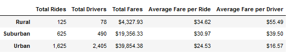
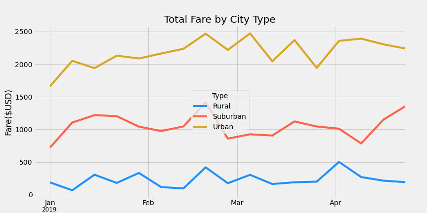

# PyBer analysis

## Overview of the Analysis

The purpose of the analysis is to help investigate relationships in our dataset among drivers, riders and city types. Through this investigation, we will be able to better understand whether certain city types are under/over-served in ride-sharing and allow us to make decisions accordingly.

## Results

From our analysis, we can see a few noticeable observations. First, urban cities make up the largest rider base followed by suburban and rural cities respectively; likewise we see total drivers and fares follow the same pattern. When looking at the average fares per ride & per driver basis, we see rural cities having the highest average, followed by suburban and urban cities respectively. The summary chart below is attached for your reference.

PyBer Summary Chart:

Furthermore, from the line chart below, we see total fares by city types fall within a range e.g. suburban cities total fares typically fall between ~$750USD to just below $1,500USD per week. We can also observe that the weekly fares vary quite a bit as we see a lot of peaks/valleys in the line chart.

PyBer Weekly Fare Summary Line Chart:

## Summary

Based on the results, I would recommend that we expand our services to suburban and especially the rural cities as those appear to be udnerserved. The reason for this recommendation is we can see from the summary chart that there are currently more riders than available drivers in those areas, meaning riders are underserved. Furthermore, we can also see there is positive variance between average fare per driver vs per ride, meaning it is likely to continue to be profitable for us to add more drivers in the area to capture more rides as the averages are a proxy measurement of average revenue and cost respectively i.e. rides being revenue & drivers being associated with cost. Conversely, we should also look at cutting back our service on urban areas as there is more drivers than rides available, and the average metrics show a negative variance. The ideal scenario is if we can incentivize urban drivers to take on suburban/rural areas, that would solve the issue at hand. Lastly, we should look into the causes of the variation in weekly fares as we see substational variation within each month; if for example the reason is due strictly to seasonality, then we can look at scaling drivers based on those parameters, similar to the before suggestion of increasing/decreasing drivers in various areas.

